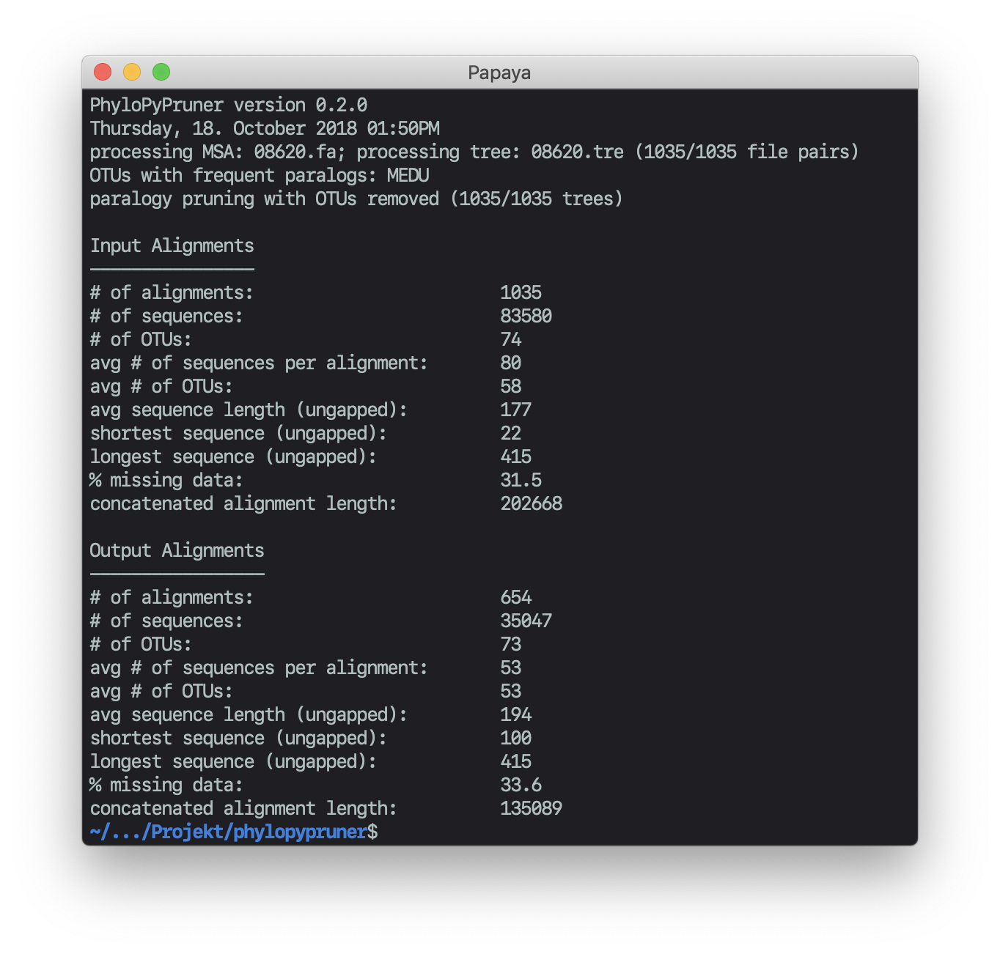
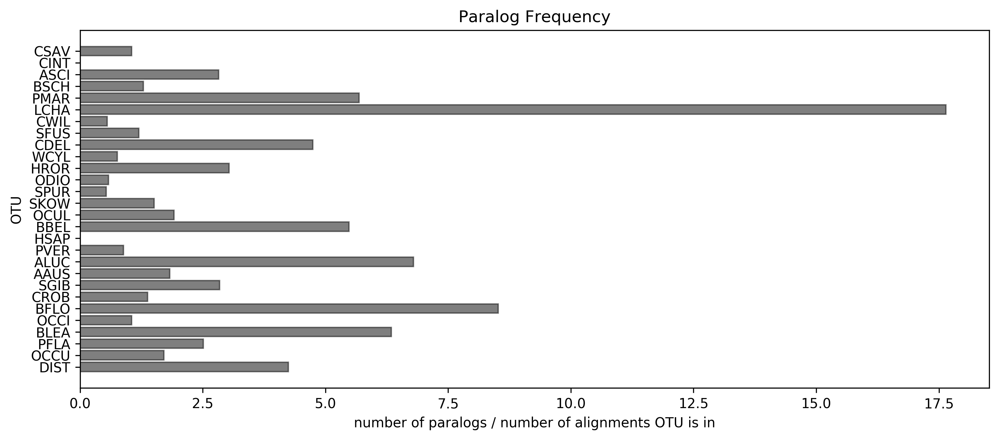

About PhyloPyPruner
-------------------

PhyloPyPruner is a Python package for tree-based orthology inference that is
used to refine the output of a graph-based approach (e.g.,
[OrthoMCL](https://www.ncbi.nlm.nih.gov/pubmed/12952885),
[OrthoFinder](https://www.ncbi.nlm.nih.gov/pubmed/26243257) or
[HaMStR](https://www.ncbi.nlm.nih.gov/pubmed/19586527)) by removing sequences
related via gene duplication. In addition to filters and algorithms seen in
pre-existing tools such as
[PhyloTreePruner](https://www.ncbi.nlm.nih.gov/pmc/articles/PMC3825643/),
[UPhO](https://academic.oup.com/mbe/article/33/8/2117/2578877),
[Agalma](https://www.ncbi.nlm.nih.gov/pmc/articles/PMC3840672/) and
[Phylogenomic Dataset
Reconstruction](https://www.ncbi.nlm.nih.gov/pubmed/25158799), this package
provides new methods for differentiating [contamination-like
sequences](https://gitlab.com/fethalen/phylopypruner/wikis/About-PhyloPyPruner#contamination-like-issues-)
from paralogs.

PhyloPyPruner is currently under active development and I would appreciate it
if you try this software on your own data and [leave
feedback](mailto:felix.thalen.1430@student.lu.se).

See [the Wiki](https://gitlab.com/fethalen/phylopypruner/wikis) for more
details.

## Features

* Prefiltering:
  * Remove short sequences
  * Remove sequences with a long branch length relative to others
  * Collapse weakly supported nodes into polytomies
* Tree-based orthology inference:
  * Mask monophylies by keeping the longest sequence or the sequence with the shortest pairwise distance
  * Root the tree using midpoint or outgroup rooting
  * Prune paralogs using one out of five methods
* Decontamination:
  * _Paralogy frequency (PF)_: Calculate the number of paralogs for an OTU divided
      by the number of alignments that said OTU is present in. Visualizing PF
      can help identify 'problem taxa' with contamination (or partial genome
      duplications, etc). PhyloPyPruner can be configured to automatically
      remove OTUs with high PF and critical OTUs can be 'protected' from
      removal using the `--include` flag.
  * _Trim divergent_: Identify and exclude OTUs on an per-alignment basis,
      where the ratio between the maximum pairwise distance within the OTU and
      the average pairwise distances with the other sequences exceeds a
      user-defined _divergence threshold_.
  * _Taxon jackknifing_: Exclude OTUs, one-by-one, during orthology inference.
      This enables the user to identify OTUs whose exclusion improves metrics
      of supermatrix quality such as number of alignments retained or percent
      missing data.

By providing earlier tree-based approaches as a single executable,
PhyloPyPruner also has a unique combination of features such as:

* Allowing polytomies in input trees for all paralogy pruning algorithms
* Collapsing weakly supported nodes into polytomies in combination with all
    paralogy pruning algorithms
* Rooting trees after monophyly masking in combination with the 'largest subtree
    (LS)' paralogy pruning algorithm

## Installation

This software runs under both Python 3 and 2.7. There are no external
dependencies, but [the plotting library Matplotlib](https://matplotlib.org/)
can be installed for generating paralog frequency plots.

You can install PhyloPyPruner using pip.

```bash
pip install --user phylopypruner
```

## Usage

To get a list of options, run the software without any arguments or with the
`-h` option. PhyloPyPruner requires either a corresponding multiple sequence
alignment (MSA), in FASTA format, and a Newick tree or, the path to a directory
containing multiple trees and alignments, as an input.

**Example 1.** Providing a single corresponding tree and alignment. In this
case monophyletic masking will be performed by choosing the sequence with the
shorter pairwise distance to its sister group and paralogy pruning will be done
using the largest subtree (LS) algorithm.

```bash
python -m phylopypruner --msa <filename>.fas --tree <filename>.tre
```

**Example 2.** Run PhyloPyPruner for every MSA and tree pair within the
directory in `<path>`. Don't include orthologs with fewer than 10 OTUs, remove
sequence shorter than 100 positions, collapse nodes with a support value lower
than 80% into polytomies, remove branches that are 5 times longer than the
standard deviation of all branch lengths and remove OTUs with a paralogy
frequency that is larger than 5 times the standard deviation of the paralogy
frequency for all OTUs.

```bash
python -m phylopypruner --dir <path> --min-taxa 10 --min-len 100 --min-support
80 --trim-lb 5 --trim-freq-paralogs 5
```

**Example 3.** Run PhyloPyPruner for every MSA and tree pair within the
directory in `<path>`. Mask monophylies by choosing the longest sequence, prune
paralogs using the maximum inclusion (MI) algorithm, remove OTUs with sequences
with an average pairwise distance that is 10 times larger than the standard
deviation of the average pairwise distance of the sequences for all OTUs,
generate statistics for the removal of OTUs using taxon jackknifing and root at
the outgroups in `<names of outgroups>`.

```bash
python -m phylopypruner --dir <path> --mask longest --prune MI --trim-divergent
10 --jackknife --outgroup <names of outgroups>
```

>>>
**Note:** Taxon jackknifing multiplies the execution time by the amount of OTUs
available within each input alignment.
>>>

FASTA descriptions and Newick names must match and has to be in one of the
following formats: `OTU|ID` or `OTU@ID`, where `OTU` is the operational
taxonomical unit (usually the species) and `ID` is a unique annotation or
sequence identifier. For example: `>Meiomenia_swedmarki|Contig00001_Hsp90`.
Sequence descriptions and tree names are not allowed to deviate from each
other. Sequence data needs to be [valid IUPAC nucleotide or amino acid
sequences](https://www.bioinformatics.org/sms/iupac.html).

\
**Figure 1.** Example of what the printed output looks like after running
PhyloPyPruner with the `--trim-freq-paralogs` flag.

## Output files

The following files are generated after running this program.

```
<output directory>/
└── phylopypruner_output/
    ├── supermatrix_stats.csv
    ├── input_alignments_stats.csv
    ├── output_alignments_stats.csv
    ├── otu_stats.csv
    ├── phylopypruner.log
    ├── paralogy_freq_plot.png*
    └── output_alignments/
        ├── 1_pruned.fas
        ├── 2_pruned.fas
        ├── 3_pruned.fas
        ...
```

If `<output directory>` has not been specified by the `--output` flag, then
output files will be stored within the same directory as the input alignment
file(s). See the [Output files
section](https://gitlab.com/fethalen/phylopypruner/wikis/Output-Files) within
[the Wiki](https://gitlab.com/fethalen/phylopypruner/wikis/home) for a more
detailed
[explanation](https://gitlab.com/fethalen/phylopypruner/wikis/Output-Files#explanation)
of each individual output file.

\* – only produced if [Matplotlib](https://matplotlib.org/) is installed

\
**Figure 2.** Example of the paralogy frequency (PF) plot.

© [Kocot Lab](https://www.kocotlab.com/) 2018
