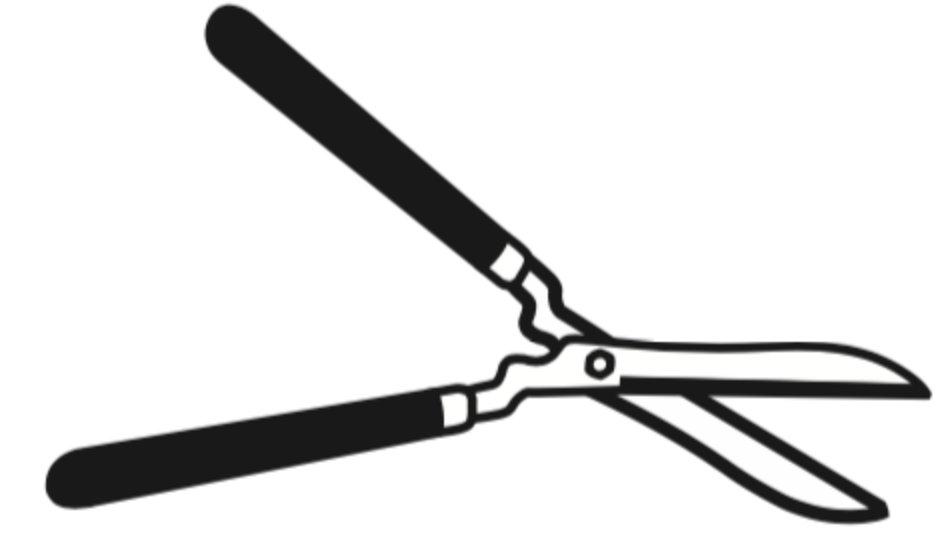

# PhyloPyPruner

PhyloPyPruner is a tree-based orthology inference program for refining
orthology inference made by a graph-based approach. In addition to implementing
previously published paralogy pruning algorithms seen in
[PhyloTreePruner](https://www.ncbi.nlm.nih.gov/pmc/articles/PMC3825643/),
[UPhO](https://academic.oup.com/mbe/article/33/8/2117/2578877),
[Agalma](https://www.ncbi.nlm.nih.gov/pmc/articles/PMC3840672/) and
[Phylogenomic Dataset
Reconstruction](https://www.ncbi.nlm.nih.gov/pubmed/25158799), this software
also provides methods for identifying and getting rid of operational
taxonomical units (OTUs) that display contamination-like issues.

PhyloPyPruner is currently under active development and I would appreciate it
if you try this software on your own data and [leave
feedback](mailto:felix.thalen.1430@student.lu.se).

See [the Wiki](https://gitlab.com/fethalen/phylopypruner/wikis) for more
details.

## Features

* Remove short sequences
* Remove relatively long branches
* Collapse weakly supported nodes into polytomies
* Prune paralogs using one out of five methods
* Measure paralogy frequency
* Remove OTUs with relatively high paralogy frequency
* Mask monophylies by keepipng the longest sequence or the sequence with the shortest pairwise distance
* Exclude individual OTUs entirely
* Root trees using outgroup or midpoint rooting
* Get rid of OTUs with sequences that display relatively high pairwise distance
* Measure impact of individual OTUs using taxon jackknifing

## Installation

This software runs under both Python 3 and 2.7. There are no external
dependencies, but [the plotting library Matplotlib](https://matplotlib.org/)
can be installed for generating paralog frequency plots.

You can install PhyloPyPruner using pip.

```bash
pip install --user phylopypruner
```

## Usage

Once installed, execute this software like so:

```bash
python -m phylopypruner
```

To get a list of options, run the software without any arguments or use the
`-h` or `--help` flag.

Either provide a single multiple sequence alignment (MSA) and a Newick tree by
using the `--msa` and `--tree` flags:

```bash
python -m phylopypruner --msa 16s.fas --tree 16s.tre
```

or, provide a `path` to an input directory, containing multiple trees and
alignments, by typing `--dir path`.

FASTA descriptions and Newick names must match and has to be in one of the
following formats: `OTU|ID` or `OTU@ID`, where `OTU` is the operational
taxonomical unit (usually the species) and `ID` is a unique annotation or
sequence identifier. For example: `>Meiomenia_swedmarki|Contig00001_Hsp90`.

Sequence descriptions and tree names are not allowed to deviate from each
other. Sequence data needs to be [valid IUPAC nucleotide or amino acid
sequences](https://www.bioinformatics.org/sms/iupac.html).

For inputting multiple files, you provide a path to the directory in which
these files reside.

```bash
python -m phylopypruner --dir <path>
```

The program will automatically look for trees and alignments with the same name
and run for each of these pair.

## Output files

The following files are generated after running this program.

```
<output directory>/
├── <timestamp>_ppp_summary.csv
├── <timestamp>_ppp_ortho_stats.csv
├── <timestamp>_ppp_run.log
├── <timestamp>_ppp_paralog_freq.csv
├── <timestamp>_ppp_paralog_freq.png*
└── <timestamp>_orthologs/
│   ├── 1_pruned.fas
│   ├── 2_pruned.fas
│   ├── 3_pruned.fas
│   └── 4_pruned.fas
...
```

If `<output directory>` has not been specified by the `--output` flag, then
output files will be stored within the same directory as the input alignment
file(s). See the [Output files
section](https://gitlab.com/fethalen/phylopypruner/wikis/Output-Files) within
[the Wiki](https://gitlab.com/fethalen/phylopypruner/wikis/home) for a more
detailed
[explanation](https://gitlab.com/fethalen/phylopypruner/wikis/Output-Files#explanation)
of each individual output file.

\* – only produced if [Matplotlib](https://matplotlib.org/) is installed

© [Kocot Lab](https://www.kocotlab.com/) 2018
